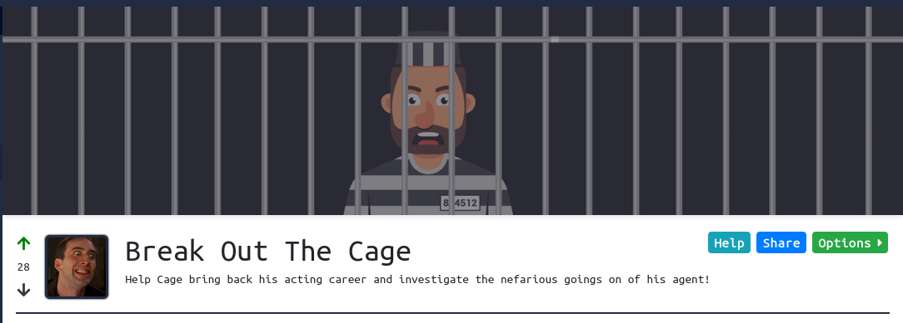
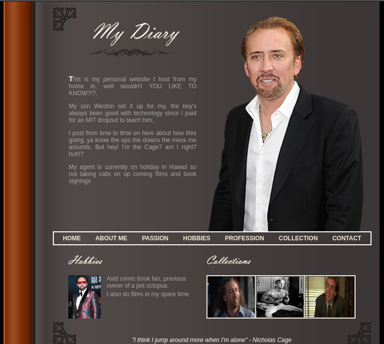
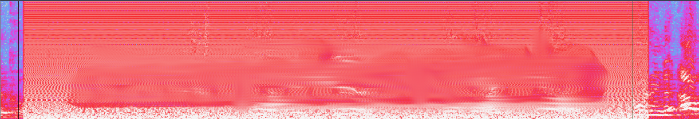
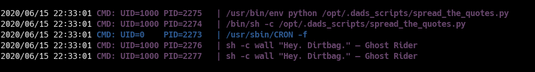
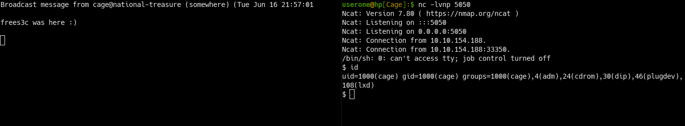
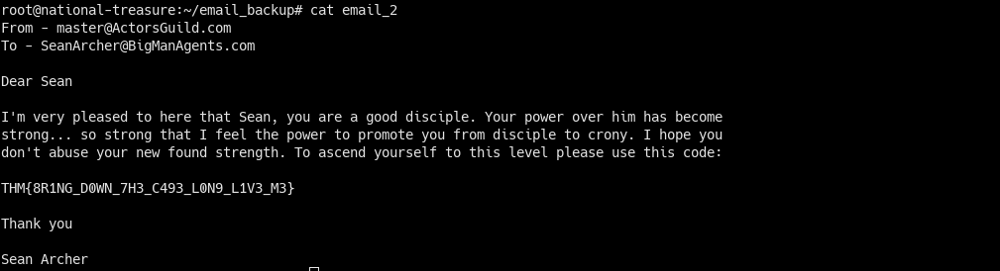

# Break Out The Cage
**Room by:** [Magna](https://tryhackme.com/p/Magna)
<br />**Difficulty:** Easy
<br />**URL:** https://tryhackme.com/room/breakoutthecage1

# ~ Enumeration:

### **Nmap:**
```

PORT   STATE SERVICE VERSION
21/tcp open  ftp     vsftpd 3.0.3
| ftp-anon: Anonymous FTP login allowed (FTP code 230)
|_-rw-r--r--    1 0        0             396 May 25 23:33 dad_tasks
| ftp-syst:
|   STAT:
| FTP server status:
|      Connected to ::ffff:10.11.9.28
|      Logged in as ftp
|      TYPE: ASCII
|      No session bandwidth limit
|      Session timeout in seconds is 300
|      Control connection is plain text
|      Data connections will be plain text
|      At session startup, client count was 1
|      vsFTPd 3.0.3 - secure, fast, stable
|_End of status
22/tcp open  ssh     OpenSSH 7.6p1 Ubuntu 4ubuntu0.3 (Ubuntu Linux; protocol 2.0)
| ssh-hostkey:
|   2048 dd:fd:88:94:f8:c8:d1:1b:51:e3:7d:f8:1d:dd:82:3e (RSA)
|   256 3e:ba:38:63:2b:8d:1c:68:13:d5:05:ba:7a:ae:d9:3b (ECDSA)
|_  256 c0:a6:a3:64:44:1e:cf:47:5f:85:f6:1f:78:4c:59:d8 (ED25519)
80/tcp open  http    Apache httpd 2.4.29 ((Ubuntu))
|_http-server-header: Apache/2.4.29 (Ubuntu)
|_http-title: Nicholas Cage Stories
Service Info: OSs: Unix, Linux; CPE: cpe:/o:linux:linux_kernel

Service detection performed. Please report any incorrect results at https://nmap.org/submit/ .
# Nmap done at Mon Jun 15 21:41:24 2020 -- 1 IP address (1 host up) scanned in 8.36 seconds

```
### Web-server 

Not a lot happening here..

### Gobuster:
```
===============================================================
2020/06/16 23:30:28 Starting gobuster
===============================================================
/images (Status: 301)
/html (Status: 301)
/scripts (Status: 301)
/contracts (Status: 301)
/auditions (Status: 301)
/server-status (Status: 403)
===============================================================
2020/06/16 23:38:25 Finished
===============================================================
```
- /scripts ; contains a bunch of random ~film~ scripts.
- /auditions/must_practice_corrupt_file.mp3 ; Nick Cage audio clip with weird noise...
- /contracts : contains empty file 

### FTP:

```
220 (vsFTPd 3.0.3)
Name (10.10.154.188:userone): anonymous
331 Please specify the password.
Password:
230 Login successful.
Remote system type is UNIX.
Using binary mode to transfer files.
ftp> ls
200 PORT command successful. Consider using PASV.
150 Here comes the directory listing.
-rw-r--r--    1 0        0             396 May 25 23:33 dad_tasks
226 Directory send OK.
ftp> get dad_tasks

```
# ~ Foothold:
Download `/auditions/must_practice_corrupt_file.mp3`
<br />Load the MP3 into Audacity and check the spectrogram at the  point the strange noise starts, it reveals a string/pass phrase :  

`Not Weston's password tho.. `

Now lets look at the file we 'yanked' from FTP: `cat dad_tasks`:
```
UWFwdyBFZWtjbCAtIFB2ciBSTUtQLi4uWFpXIFZXVVIuLi4gVFRJIFhFRi4uLiBMQUEgWlJHUVJPISEhIQpTZncuIEtham5tYiB4c2kgb3d1b3dnZQpGYXouIFRtbCBma2ZyIHFnc2VpayBhZyBvcWVpYngKRWxqd3guIFhpbCBicWkgYWlrbGJ5d3FlClJzZnYuIFp3ZWwgdnZtIGltZWwgc3VtZWJ0IGxxd2RzZmsKWWVqci4gVHFlbmwgVnN3IHN2bnQgInVycXNqZXRwd2JuIGVpbnlqYW11IiB3Zi4KCkl6IGdsd3cgQSB5a2Z0ZWYuLi4uIFFqaHN2Ym91dW9leGNtdndrd3dhdGZsbHh1Z2hoYmJjbXlkaXp3bGtic2lkaXVzY3ds%
```

Decoded base64 returns:
```
Qapw Eekcl - Pvr RMKP...XZW VWUR... TTI XEF... LAA ZRGQRO!!!!
Sfw. Kajnmb xsi owuowge
Faz. Tml fkfr qgseik ag oqeibx
Eljwx. Xil bqi aiklbywqe
Rsfv. Zwel vvm imel sumebt lqwdsfk
Yejr. Tqenl Vsw svnt "urqsjetpwbn einyjamu" wf.

Iz glww A ykftef.... <REDACTED>
```
The decoded base64 string looks like ROT13 or a ceaser cypher?
<br /> Hmm.. Nope!
<br />Ahh there was a challenge in 'RACTF' a few weeks ago that used a Vigenère cypher..
>The Vigenère cipher is a method of encrypting alphabetic text by using a series of interwoven Caesar ciphers, based on the letters of a keyword. It employs a form of polyalphabetic substitution.

Vigenère requires a key or pass phrase to decode the text. Let's use the text we found in the MP3 file earlier.
```
Dads Tasks - The RAGE...THE CAGE... THE MAN... THE LEGEND!!!!
One. Revamp the website
Two. Put more quotes in script
Three. Buy bee pesticide
Four. Help him with acting lessons
Five. Teach Dad what "information security" is.

In case I forget.... <ANSWER TO TASK 1 FOUND HERE>
```

Now we have Weston's password lets ssh into the box: `ssh weston@cage.thm`

# ~ PrivEsc to Cage:
Let's perform some basic enumeration and see what we find..
<br />`id` ; note group (cage)
```

```
`sudo -l`
```
User weston may run the following commands on national-treasure:
    (root) /usr/bin/bees
```
`cat /usr/bin/bees`
```
#!/bin/bash

wall "AHHHHHHH THEEEEE BEEEEESSSS!!!!!!!!"
```
`find / -perm -4000 2>/dev/null`
> Nothing interesting here..

Hmm keep getting 'walled' with random Nicholas Cage quotes.. So I uploaded `pspy64` to the box, `chmod +x ; ./pspy64`:

We can see that the file `spread_the_quotes.py` is being run as user:cage.
Alternatively, `find / -type d -group cage 2>/dev/null/` will return the same results:
```
/opt/.dads_scritps/spread_the_quotes.py
/opt/.dads_scritps/.files/.quotes
```
If we `cat spread_the_quotes.py` we can see its calling 'wall' + input from .quotes. This is our attack route.
Modify `.quotes` to send us a python reverse shell:
```
1. rm .quotes ; vim .quotes
2. Frees3c was here ; <REV SHELL HERE>
3. :wq
4. chmod weston:cage .quotes
```
Save and wait for the cronjob to run the script :


# ~ Root;
`ls -la`
```

```
`cat Super_Duper_Checklist`
```
<Blah>
<Blah>
5 - Figure out why Weston has this etched into his desk: THM{ANSWER NO.2 FOUND HERE}
```
`emails/`
- email_1 : note "face" repeated several times.
- email_2 : Sean's user name is root? 
- email_3 : note "face" is mentioned several more times, and another _jumbled_ up word.
```
Hey Son

Buddy, Sean left a note on his desk with some really strange writing on it. I quickly wrote
down what it said. Could you look into it please? I think it could be something to do with his
account on here. I want to know what he's hiding from me... I might need a new agent. Pretty
sure he's out to get me. The note said:

<ENCODED PHRASE HERE>

The guy also seems obsessed with my face lately. He came him wearing a mask of my face...
was rather odd. Imagine wearing his ugly face.... I wouldnt be able to FACE that!! 
hahahahahahahahahahahahahahahaahah get it Weston! FACE THAT!!!! hahahahahahahhaha
ahahahhahaha. Ahhh Face it... he's just odd. 

Regards
The Legend - Cage

```
Decode the string to reveal a password. Then `su` to root!!
<br /> Then enumerate the emails dir to find root flag:



# Resources:
https://www.boxentriq.com/code-breaking/vigenere-cipher
